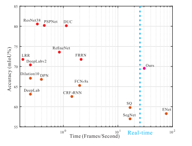
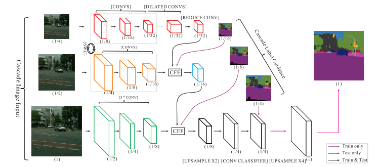
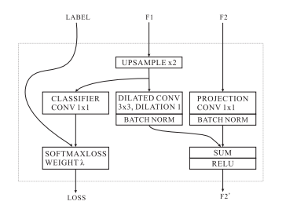
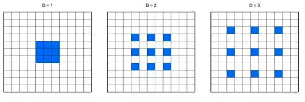

# Semantic Segmentation by ICNet
*Implementation of ICNet by Tensorflow*

---

## What is ICNet
ICNet is a compressed-PSPNet Based image cascade network, proposed by H. Zhao et al. **ICNet for Real-Time Semantic Segmentation
on High-Resolution Images**. Paper is [here ](https://arxiv.org/pdf/1704.08545.pdf). This network is characterized by its runtime and multi-scale input architecture.

Accuracy is measured by Cityscapes data.

This network runs at the speed of 30fps with single GPU.
The network is largely composed of simple 3 layers encoding network and 4 layers decoding network.

Different scale of layers are fused in CFF(Cascade Feature Fusion) box.  

## Dilated Convolution

Dilated convolution encourages a network to dense labeling and
enlarge the receptive field.

In tensorflow, it implemented by using `tf.nn.astrous`

This picture helps understand how dilate convolution works. Depending on dilation value, the filter for convolution become sparse. As a result, it leads to expand receptive fields of layers.  

## result
Trained with 100 road images.

## Setup
### Framework and Package
* Python 3.5.2
* Tensorflow 1.3.0
* Numpy 1.13.1
* Scipy 0.19.1

### Making Folder
At this directory.

`mkdir data`

`mkdir output`

### Dataset
Example data is from KITTI road dataset.

Download from [here](https://drive.google.com/open?id=1NwEgQtup5Wdl2lR13twjgFdMcOzaj-GM)(80Mb). 

Download `road` folder.

Need to put `road` folder under `./data` folder.

## Test

`python test.py`

You will have an output example in `./output/test_output.png`.

## Train and Test

1, Make sure you have training data under `./data` folder.

2, `python main.py`

You will have an output example in `./output/post_train_output.png` .

## Problem
Network architecture should be really similar to the paper. I was
supposed to train whole data from KITTI, but it was hard to train whole data due to the lack of hardware resource. I submit codes for training a hundred images.
